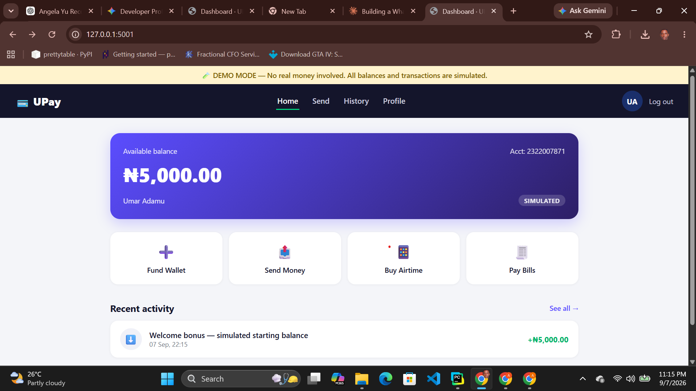

# UPay 💳

**A fintech wallet, fully simulated — every rand/naira/dollar is fake, every flow is real.**

UPay is an Opay-inspired digital wallet that demonstrates how fintech apps handle the
things that actually matter: PIN-gated transactions, atomic balance updates, an
auditable transaction ledger, and peer-to-peer transfers between accounts — all built
with **Python, Flask, Jinja2, and SQLite**, no payment processor involved. It's a
sandbox for showing off backend fundamentals (hashed secrets, transactional integrity,
receipt generation) without touching a single real cent.



> ⚠️ **This is a simulation.** No real money, cards, banks, or telecom networks are
> involved anywhere in this codebase.

## Features
- Auth (register/login) with hashed passwords + a 4-digit transaction PIN
- New users get a simulated starting balance (₦5,000 demo money)
- **Fund Wallet** — simulated card top-up
- **Send Money** — transfer to any other UPay user by username, phone, or account number
- **Buy Airtime** — simulated top-up across 4 fake networks
- **Pay Bills** — simulated electricity/DSTV/internet/water payments
- Full transaction history with filters, and a receipt page per transaction
- Every sensitive action (transfer, airtime, bills) requires the account's transaction PIN
- Clear "DEMO MODE" banner + disclaimers throughout, so it's obviously a simulation

## Tech stack
- **Backend:** Flask, Flask-SQLAlchemy, Flask-Login
- **Frontend:** Jinja2 templates, vanilla CSS + JS
- **Database:** SQLite (swap the URI in `app.py` for Postgres/MySQL in production)

## Getting started

```bash
python -m venv venv
source venv/bin/activate      # Windows: venv\Scripts\activate

pip install -r requirements.txt
flask --app app init-db
python app.py
```

Visit **http://localhost:5001**, register an account (you'll get a demo ₦5,000
balance), and try funding your wallet, sending money to a second test account,
buying airtime, or paying a fake bill.

To test transfers between users, register two accounts (e.g. in separate
browser tabs / incognito windows) and send between them.

## Project structure
```
upay/
├── app.py                  # Routes, models
├── requirements.txt
├── upay.db                  # created on first run
├── templates/
│   ├── base.html            # shell + demo banner
│   ├── app_base.html        # authenticated layout w/ top nav
│   ├── login.html / register.html
│   ├── dashboard.html       # wallet card + quick actions + recent activity
│   ├── fund.html / transfer.html / airtime.html / bills.html
│   ├── history.html         # filterable transaction list
│   ├── receipt.html         # single transaction receipt
│   └── profile.html
└── static/
    ├── css/style.css
    └── js/app.js
```

## How it works
- **Wallet balance** is just a `Float` column on `User` — funding/sending/spending
  simply increments or decrements it inside a DB transaction.
- **Every action** (deposit, transfer, airtime, bill) creates a `Transaction` row
  with a unique reference, so there's always an auditable history + receipt.
- **Transfers** are peer-to-peer between two `User` rows — money only moves
  between accounts that exist in this same demo database, never anywhere real.
- **PIN protection** — transfers, airtime, and bill payments all check a hashed
  4-digit PIN set at registration, mirroring how real wallet apps gate money
  movement.

## Ideas to extend this for your portfolio
- Add spending limits / KYC tiers
- Add scheduled/recurring payments
- Add a savings "goal" feature with interest simulation
- Add an admin view to reset/top-up demo accounts
- Deploy to Render/Railway with Postgres

## Deployment notes
Set a real `UPAY_SECRET_KEY` environment variable in production. Since this is
a demo app, consider periodically resetting the database (e.g. a nightly cron)
so demo balances don't run away in a public deployment.
